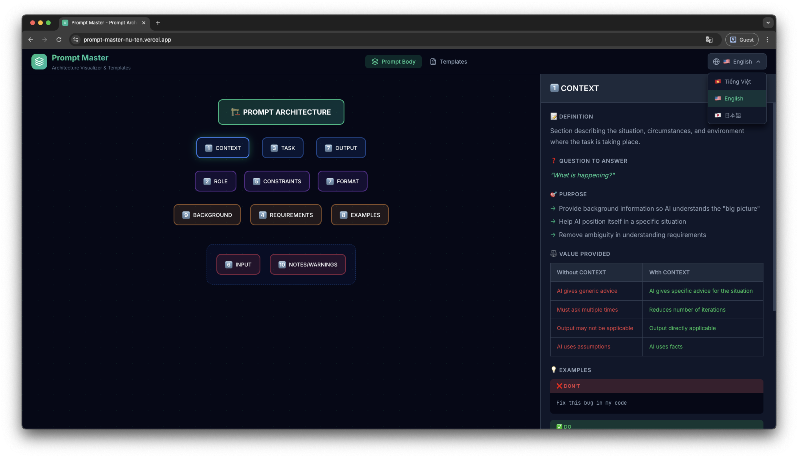
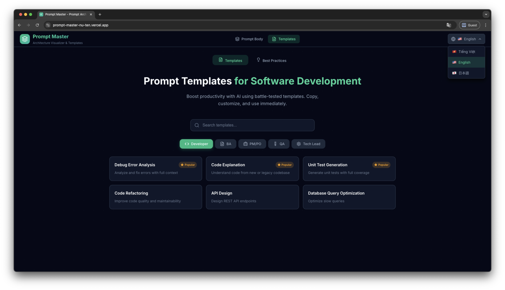

<div align="center">

# 🏗️ Prompt Master

### Prompt Architecture Visualizer & Templates Library

[](https://prompt-master-nu-ten.vercel.app/)
[](https://react.dev/)
[](https://vitejs.dev/)
[](LICENSE)

**A visual tool for understanding prompt structure and a library of battle-tested templates to help you create more effective prompts.**

[🔗 Live Demo](https://prompt-master-nu-ten.vercel.app/) · [📖 Features](#-features) · [🚀 Getting Started](#-getting-started)

</div>

---

## 📸 Screenshots

### Prompt Body Visualizer
> Interactive tree displaying the 10 core components of prompt anatomy



### Prompt Templates
> Library of 25+ templates for Developer, BA, PM/PO, QA, and Tech Lead roles



---

## ✨ Features

### 🌳 Prompt Body Visualizer
- **Interactive Tree View** - Hierarchical visualization of prompt structure
- **Detail Panel** - Click any node to view definitions, purposes, and examples
- **10 Core Components**: CONTEXT, TASK, OUTPUT, ROLE, CONSTRAINTS, FORMAT, REQUIREMENTS, EXAMPLES, INPUT, NOTES/WARNINGS

### 📝 Prompt Templates
- **25+ Production-ready Templates** - Battle-tested in real projects
- **5 Role Categories**: Developer, BA, PM/PO, QA, Tech Lead
- **Search & Filter** - Quickly find the template you need
- **One-click Copy** - Copy any template instantly

### 🎓 Best Practices
- **GUIDE Framework** - 5 principles for effective prompting
- **4 Prompt Patterns** - Context+Task+Format, Role+Goal+Constraints, Step-by-step, Few-shot
- **Do's and Don'ts** - Tips to avoid common mistakes

### 🌐 Multi-language Support
- 🇻🇳 **Vietnamese** (Default)
- 🇺🇸 **English**
- 🇯🇵 **Japanese**

---

## 🛠️ Tech Stack

| Category | Technologies |
|----------|-------------|
| **Framework** | React 18 |
| **Build Tool** | Vite 5 |
| **Styling** | Vanilla CSS (Dark theme) |
| **Icons** | Lucide React |
| **Deployment** | Vercel |

---

## 🚀 Getting Started

### Prerequisites
- Node.js 18+
- npm or yarn

### Quick Start

```bash
# Clone repo
git clone https://github.com/your-username/prompt-master.git
cd prompt-master

# Install dependencies
npm install

# Run development server
npm run dev
```

Open `http://localhost:5173` to view the app.

### Build for Production

```bash
npm run build
npm run preview
```

---

## 📁 Project Structure

```
prompt-master/
├── src/
│   ├── components/
│   │   ├── PromptBody.jsx    # Tree view + Detail panel
│   │   └── Templates.jsx     # Templates library
│   ├── contexts/
│   │   └── LanguageContext.jsx  # i18n provider
│   ├── data/
│   │   ├── promptTree.js     # Prompt anatomy data
│   │   └── templates.js      # Templates data
│   ├── App.jsx               # Main app + navigation
│   ├── main.jsx              # Entry point
│   └── index.css             # Global styles
├── public/
├── img/                      # Screenshots
└── package.json
```

---

## 🤝 Contributing

Contributions are welcome! Feel free to:
1. Fork the repo
2. Create your feature branch (`git checkout -b feature/AmazingFeature`)
3. Commit changes (`git commit -m 'Add AmazingFeature'`)
4. Push to branch (`git push origin feature/AmazingFeature`)
5. Open a Pull Request

---

## 📄 License

This project is licensed under the MIT License - see the [LICENSE](LICENSE) file for details.

---

<div align="center">

**Made with ❤️ for the developer community**

[⬆️ Back to top](#-prompt-master)

</div>
